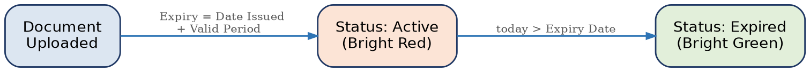

[← Back to index](../README.md) · [3. System Features overview](00-overview.md)

# 3.5 Status Logic

**Description:** Document status must always be system-derived, never manually set, so the dashboard remains accurate without manual intervention.

| ID | Requirement | Priority |
|---|---|---|
| FR-STAT-1 | The system shall calculate a CM document's status as Active when the current date is on or before the Expiry Date. | Must |
| FR-STAT-2 | The system shall calculate a CM document's status as Expired when the current date is after the Expiry Date. | Must |
| FR-STAT-3 | The system shall never allow a user to manually set document status; status shall always be derived from the Expiry Date. | Must |
| FR-STAT-4 | The system shall automatically transition a document from Active to Expired at the moment its Expiry Date passes, via a scheduled job and/or a query-time calculation, without requiring user action. | Must |
| FR-STAT-5 | The dashboard shall display Active status with a bright red indicator and Expired status with a bright green indicator, per the source requirement, supplemented with a text label or icon to support colorblind accessibility (WCAG 1.4.1). | Must |

*Figure 1 — CM document status lifecycle*

---
[← Previous: 3.4 Document Metadata & Naming Convention](3.4-document-metadata-naming-convention.md) · [Back to index](../README.md) · [Next: 3.6 Home Dashboard →](3.6-home-dashboard.md)
