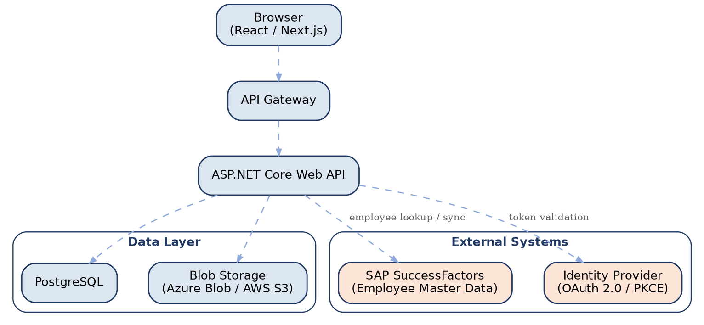
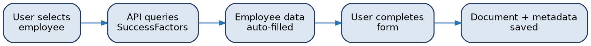

[← Back to index](README.md)

# 5. System Architecture

The originally recommended architecture favored a conventional, well-supported enterprise stack — React/Next.js frontend, a separate ASP.NET Core Web API, containers on Kubernetes. The delivered system instead consolidates the frontend and Web API layer into a single Next.js deployment (Route Handlers and Server Actions serve the role the separate API tier was to play), which still satisfies §2.5's server-side-RBAC and credential-isolation constraints while reducing the number of moving parts for a team without dedicated backend engineers. The table below reflects what was actually built.

| Layer | As built |
|---|---|
| Frontend + Backend | Next.js 16 (App Router), a single deployment — Route Handlers and Server Actions serve as the Web API layer described below |
| Database | PostgreSQL (Supabase-managed in the current deployment; any standard Postgres works, since the data layer targets plain Postgres rather than a vendor-specific API) |
| Authentication | OAuth 2.0 with PKCE (Microsoft Entra ID) via Auth.js, with a configuration-gated internal-credentials fallback (see [FR-AUTH-7](03-system-features/3.1-authentication-authorization.md)) for environments without a live enterprise identity provider |
| Document Storage | S3-compatible object storage (Cloudflare R2 in the current deployment; AWS S3 and other S3-compatible providers are also supported through the same adapter) — local disk in development |
| Deployment | Vercel (serverless functions), not containers/Kubernetes — see the scalability note in [7.3](07-non-functional-requirements.md#73-scalability) |

*Figure 2 — Logical system architecture*

The Web API layer is the single point of integration with SAP SuccessFactors (employee data) and the identity provider (authentication), so that integration credentials and logic are never exposed to the browser.

## Integration Flow: Upload with SuccessFactors Lookup

*Figure 3 — Employee lookup and upload data flow*

---
[← Previous: 4. External Interface Requirements](04-external-interface-requirements.md) · [Back to index](README.md) · [Next: 6. Data Requirements →](06-data-requirements.md)
